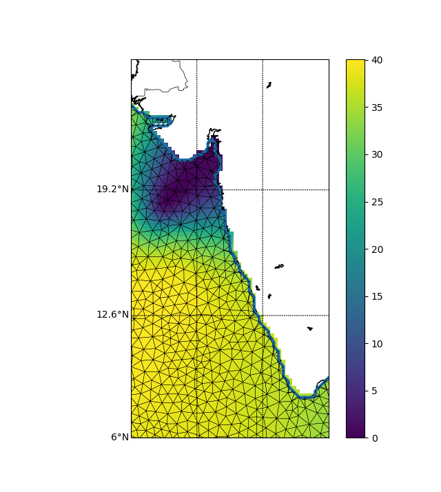

# Interpolation using PyDIVA

Automation of interpolating large scale datasets using PyDIVA

- - - -

## Getting started

### Prerequisites

1. The [Diva](https://github.com/gher-ulg/diva) interpolation tool has to be installed and compiled on your machine. See the related [documentation](https://github.com/gher-ulg/DIVA/blob/master/README.md#installing) for the installation.

2. The [Diva-Python-Tools](https://github.com/gher-ulg/DivaPythonTools) interface has to be installed on your system. See related [documentation](https://github.com/gher-ulg/DivaPythonTools/blob/master/README.md) for the installation.

### Project Description

The project consists of the following parts :

1. rtod (Real time to Delayed mode)
    * The program `update.py` takes 3 file names as command line parameters (ARGO_Observations, ARGO_Global and output filename).
    * ID's which changed modes from R to D and the ID's that exist in ARGO Global file, but not in the ARGO Observations file are returned.
    * example : 
    `python3 update.py ARGO_Observations_1999_2019.txt ar_index_global_prof.txt output.txt`

2. interpol (Data Interpolation)
    * The program `interpolFinal.py` takes in 3 command line arguments (ARGO_Core, ARGO_Observations and output path).
    * The temperature and salinity values are distributed over a range of pressure values, which are interpolated for standard depths.
    ] NOTE: The standard depths can be kept in contour.dept file or can be a static array in interpolFinal.py
    * The interpolated values are stored in files based on the date, i.e. the main directory (year) contains 12 directories (months). Each month is divided into 3 directories (1-10, 11-20 & 21-last). The files then, are stored in these folders.
    * example : 
    `python3 interpol.py ARGO_CORE_2018_Latest.dat ARGO_Observations_1999_2019.txt 2018`

3. DIVA 
    1. data1.py (single)
        * Takes an MLD file, coast.cont file and param.par file as command line arguments.
        * Gives the plots for temperature and salinity values while storing the .nc (temp.nc and sal.nc) files in an output directory.
        * example :
        `python3 data1.py example/dp10mts.dat example/coast.cont example/param.par`

        > Results from data1.py : 

         temperature analysis at 10mts depth (Arabian Sea)
        

         salinity analysis at 10mts depth (Arabian sea)
        

    2. fastdata.py (single)
        * Takes an MLD file, coast.cont file and param.par file as command line arguments.
        * Stores .nc (temp.nc and sal.nc)files in an output directory.
        * example :
        `python3 fastdiva.py example/dp10mts.dat example/coast.cont example/param.par`

    3. analyse.py (multiple)
        * Takes the following as command line arguments : [dir path containing years] [yyyymmdd] [invalid str] [path to input file].
        * The input file should have coast.cont.* files, coast.depth file and param.par file.
        * example : 
        `python3 analyse.py example/. 20181211 9999.000 example.py`

**NOTE**

* _The programs above are dependant on the path to DIVA-4.7.2 directory. Modify the path (divadir) in the source code accordingly._
* Refer report.pdf for more detailed info on the project.
* Download the files from this [link](**insert drive link here**) and paste "ar_index_global_prof.txt" to "rtod" folder & "ARGO_CORE_2018_Latest.txt" to "interpol" folder before running the example commands